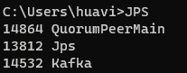
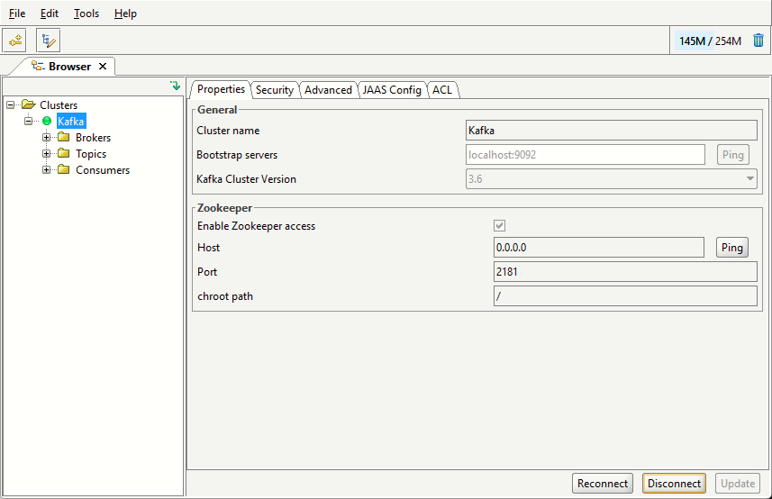
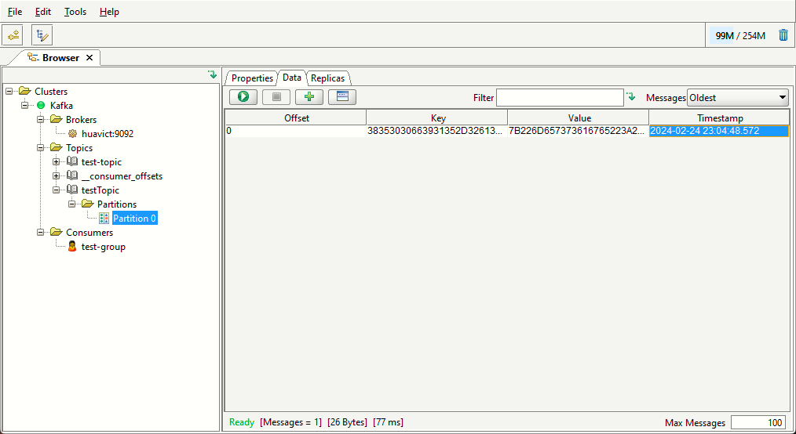

[【Kafka】基于Windows的Kafka有关环境搭建、以及使用.NET环境开发的案例代码与演示|知乎](https://zhuanlan.zhihu.com/p/624978771)
[Scala安装](https://www.scala-lang.org/download/scala2.html)

[zookeeper安装](https://zookeeper.apache.org/releases.html#download)

[Kafka安装](https://kafka.apache.org/downloads.html)

[offexplorer安装](https://www.kafkatool.com/download.html)

路径
D:\Kafka
- Kafka - D:\Kafka\kafka_2.13-3.6.1
- zookeeper - D:\Kafka\apache-zookeeper-3.9.1

环境变量，添加bin
- SCALA_HOME - D:\Program Files (x86)\scala
- ZOOKEEPER_HOME - D:\Kafka\apache-zookeeper-3.9.1

坑：注意路径是斜杠/，如果要使用\反斜杆，需要写双反斜杠\\

在Kafka路径下执行如下命令行
.\bin\windows\kafka-server-start.bat .\config\server.properties

scala -version

启动：命令行输入zkserver启动zookeeper，在Kafka路径执行.\bin\windows\kafka-server-start.bat .\config\server.properties启动Kafka
 

